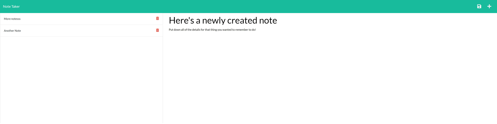

# Note Taker Application

## Description

This application is designed to help you track all of the "to-dos" and "to-remember" of your days, by allowing you to create unique notes that can be saved for later. Each note has a entry block for a title and the note content and the notes can be saved. Once you've completed the task or no longer need the reminder, the note can be deleted.

This is a fully deployed application that uses [Heroku](https://devcenter.heroku.com/) to serve out the webpage.

Check out the site [here](https://young-lowlands-35095.herokuapp.com/)!

Also, check out the code on [Github](https://github.com/ChannellNumber5/CR-NoteTaker)!

This application required the use of Express.js to handle the api requests on the backend, so that the notes could be saved on the server instead of in localstorage on the browser. It also required used the fs node module to handle writing and deleting the saved notes to the .json database.

## Installation & Usage
Since this application is deployed on heroku, there is nothing that the user needs to install. They simply need to navigate to the site URL provided above and start inputting in their notes. The application is coded such that, when the user inputs a note title and a note "body section, the save button appears. When the user saves the note, it will appear on the lefthand side of the page and the user has the choice of navigating to a previous note or deleting any previous notes.

## Credits
The client side static files were a boilerplate provided by the University of Washingtong Coding Bootcamp along with the index.js base code. All other code (server.js to handle the API requests, id creator script) were coded by Christina Robinson.

Email: [CLRCoding@gmail.com](mailto:CLRCoding@gmail.com)

Github: [ChannellNumber5](https://github.com/ChannellNumber5)
 
## Tests
There were no tests created or run for this specific application

## License

This project is licensed under the MIT license.

[MIT License](https://opensource.org/licenses/MIT)

## Resources

-[node.js Path](https://nodejs.dev/learn/the-nodejs-path-module#pathjoin)

-[JSON.stringify Parameters](https://developer.mozilla.org/en-US/docs/Web/JavaScript/Reference/Global_Objects/JSON/stringify)

-[Deploying to Heroku](https://devcenter.heroku.com/articles/getting-started-with-nodejs?singlepage=true#set-up)

Ran into an issue with `heroku create` command not initializing with the message `Git remote heroku added` and below link had the fix:

-[Stack Overflow for Git remote heroku](https://stackoverflow.com/questions/30255058/heroku-deployment-git-remote-not-added)

-[Using array.prototype.map()](https://www.digitalocean.com/community/tutorials/4-uses-of-javascripts-arraymap-you-should-know)

-[Body Parser](https://stackoverflow.com/questions/55558402/what-is-the-meaning-of-bodyparser-urlencoded-extended-true-and-bodypar)
